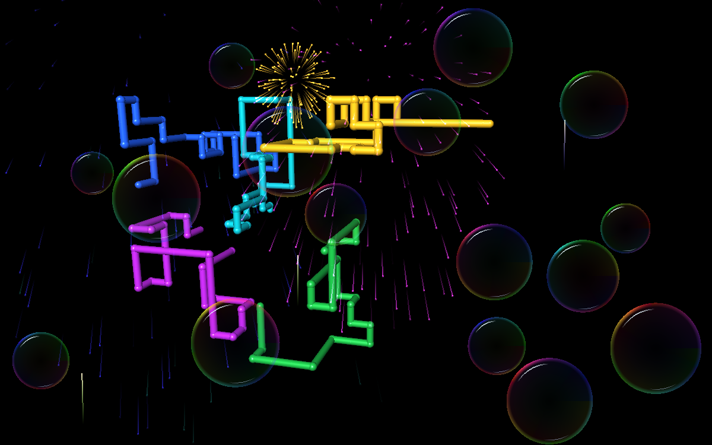
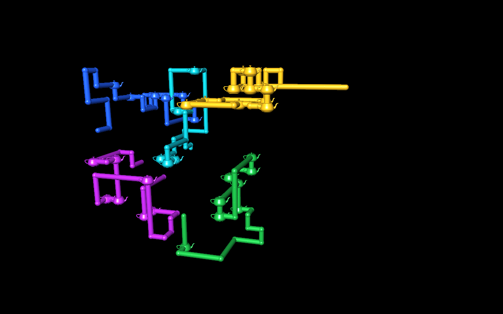

# Retro Pipes

Classic-inspired 3D pipes, fireworks and glass bubbles. Run each one alone or overlap them as a live desktop wallpaper, Windows screensaver, or windowed animation. Every monitor has its own random cycle.



## Download and run

Download **Retro-Pipes-v1.2.zip** from the [latest release](https://github.com/S0MBRX/retro-pipes/releases/latest), extract it, and open **RetroPipes.exe**.

- **Start wallpaper** animates behind desktop icons. Use its system-tray icon to open controls or stop it.
- **Try screensaver** fills your displays. Move the mouse or press any key to exit.
- **Window preview** supports Space to pause, R for a fresh scene, and Esc to close.
- To use it when Windows is idle, right-click **RetroPipes.scr**, choose **Install**, and configure the wait time in Windows Screen Saver Settings. Keep the files in a permanent folder.

## Settings


Use **Pipes only**, **Fireworks only**, **Bubbles only**, or **All three**. The layer checkboxes let you make any combination. These preset buttons turn off random layer selection so the chosen combination plays as selected; you can re-enable layer chances afterward.

Choose Classic, Electric or Chrome pipe colours, growth speed, pipe count and optional slow rotation. Firework intensity accepts 1–30; bubble count accepts 1–100. Fireworks launch and burst into fading sparks; translucent iridescent bubbles drift and bounce.

Every layout picks a random starting colour from the selected theme. A single pipe can use any of the theme's colours, including when randomized settings are turned off.

The number boxes accept **speed 1–1000** and **pipe count 1–500**, beyond the sliders' convenient ranges of 1–10 and 1–9. Larger typed values remain active even though the slider stays at its end. Moving a slider selects a value within its regular range.

### Teapot easter egg

Enable **Teapot easter egg** for an occasional Utah teapot at a pipe bend. The default chance is **0.5% per bend**; the number box accepts 0–100%. A larger value makes it easier to spot.



### Independent random cycles

Turn on **Enable random cycle**, then tick only the settings that should change:

- **Speed / Count / Colour** independently randomize those pipe settings. Numbers range from 1 to your entered values; colour chooses one of the three themes.
- **Rotation chance** independently chooses rotation on/off using the percentage beside it.
- **Pipes / Fireworks / Bubbles chance** independently choose whether each layer appears, using their percentages. Unchecked options follow your manual layer choices.
- **Firework intensity + bubble count** rolls those amounts from 1 to your entered values.

Quick presets: **Pipes random** rolls pipe speed, count, colour and rotation; **Mix random** rolls only the layers; **All random** rolls all available categories. Teapot probability stays at your chosen value.

Each monitor rolls independently on start, when its scene finishes, on R in a preview, or through **Roll new scenes on every screen** in the tray menu. Pipe scenes finish when full; effects-only scenes cycle after 35–60 seconds. Random values can occasionally match by chance, but no settings roll is shared across monitors.

If all layer rolls are off, one manual layer is kept so the screen is never empty (Fireworks first, then Bubbles, then Pipes). Therefore, layer percentages describe each independent chance roll rather than the final frequency after this fallback. With random cycle off, all screens use your manual settings and generate independent animation paths.

The tray menu's **Current screen settings** shows each monitor's roll. Your saved manual values are preserved.

Settings save when starting a mode or closing the controls. They are stored in `%LOCALAPPDATA%\RetroPipes\settings.xml`.

## Requirements

- 64-bit Windows 10 or 11 with .NET Framework 4.x and OpenGL support.
- No installer, administrator access, network connection, or extra packages are required to run the app.
- Tested on Windows 10. Live wallpaper uses Explorer's WorkerW surface; compatibility may vary with shell changes or other wallpaper apps. Restart wallpaper after Explorer, display layout, or scaling changes.
- Wallpaper does not register itself to start with Windows. The app is unsigned.
- This is an original recreation, not Microsoft's original screensaver binary.
- Utah teapot model data comes from freeglut; its license is in [THIRD-PARTY-NOTICES.txt](THIRD-PARTY-NOTICES.txt), embedded in the binary, and available through **Credits** in the app.

## Build

From the repository folder, run this in PowerShell:

```powershell
.\source\Build.ps1
```

The script uses the C# compiler bundled with 64-bit .NET Framework and produces `RetroPipes.exe` and `RetroPipes.scr` in the repository root. No NuGet dependencies are needed.

## Test

On a Windows desktop, run:

```powershell
New-Item -ItemType Directory -Force work | Out-Null
$process = Start-Process .\RetroPipes.exe -ArgumentList '--self-test work' -Wait -PassThru
if ($process.ExitCode -ne 0) { throw 'Self-test failed. See work/test-error.txt.' }
Get-Content .\work\test-results.txt
```

The tests exercise selective random settings, 0%/100% chances, old-settings migration, extended values, serialization, high-speed growth, dense scenes, collision avoidance, scene cycling, teapot generation, all seven layer combinations, three simultaneous independent screen cycles, bounded effects, OpenGL rendering, preview embedding, launcher controls and wallpaper attachment when a desktop surface is available. Test windows are placed offscreen. Tests leave saved user settings unchanged.

See [README.txt](README.txt) for command-line modes and uninstall instructions.
