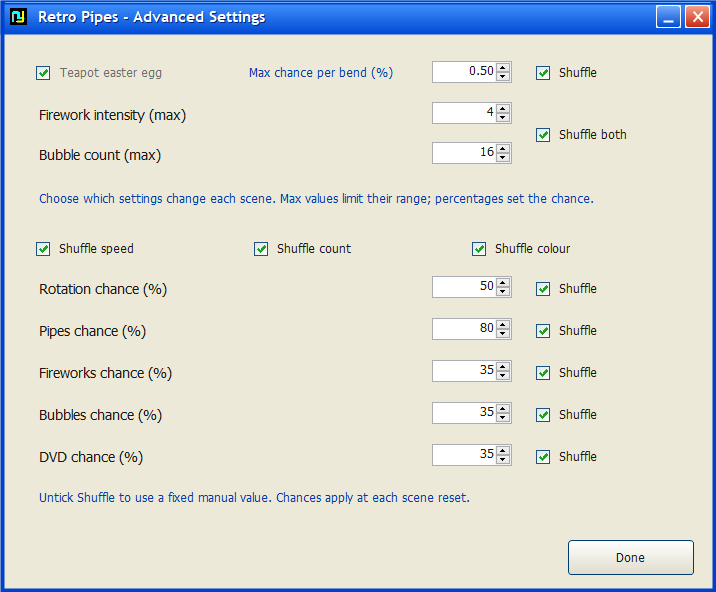
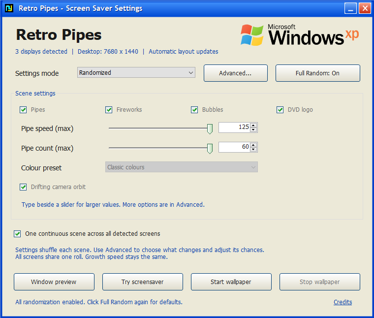

# Retro Pipes

Classic-inspired 3D pipes, fireworks, glass bubbles and a bouncing DVD logo. Run each one alone or overlap them as a live desktop wallpaper, Windows screensaver, or windowed animation. Choose independent scenes per monitor or one continuous scene across all screens.


## Download and run

Download **Retro-Pipes-v1.7.zip** from the [latest release](https://github.com/S0MBRX/retro-pipes/releases/latest), extract it, and open **RetroPipes.exe**.

- **Start wallpaper** animates behind desktop icons. Use its system-tray icon to open controls or stop it.
- **Try screensaver** fills your displays. Move the mouse or press any key to exit.
- **Window preview** supports Space to pause, R for a fresh scene, and Esc to close.
- To use it when Windows is idle, right-click **RetroPipes.scr**, choose **Install**, and configure the wait time in Windows Screen Saver Settings. Keep the files in a permanent folder.

## Settings


The control panel uses an XP-style blue title bar, cream panels, classic buttons, green checkmarks and the Windows XP wordmark. The title bar can be dragged; minimize and close work normally. The header shows the current display count and desktop size.

Choose **Manual** or **Randomized** from the dropdown above one compact settings frame. Tick **Pipes**, **Fireworks**, **Bubbles** and/or **DVD logo** to select any combination. Speed, pipe count, colour preset, a drifting camera orbit and screen layout remain on the main panel. Switching modes preserves entered values.

**Advanced...** opens teapot settings, firework intensity, bubble count, and (in Randomized mode) every individual Shuffle switch and rotation/layer chance. Closing Advanced keeps your edits; hiding the controls does not disable their settings. Existing colour presets remain in the main panel; a custom palette editor is not included.



Custom controls now clear their previous pixels and preserve the graphics clipping region and origin when drawing text. This fixes text escaping its control during partial repaints and prevents old text/checkmarks/slider positions from sticking.

Choose Classic, Electric or Chrome pipe colours, growth speed, pipe count and an optional drifting camera orbit. Firework intensity accepts 1–30; bubble count accepts 1–100. Fireworks launch and burst into fading sparks; translucent iridescent bubbles drift and bounce.

Every layout picks a random starting colour from the selected theme. A single pipe can use any of the theme's colours, including when randomized settings are turned off.

The number boxes accept **speed 1–1000** and **pipe count 1–500**, beyond the sliders' convenient ranges of 1–25 and 1–10. The default values (and randomized upper limits) are speed **25** and count **10**. Larger typed values remain active even though the slider stays at its end. Moving a slider selects a value within its regular range.

### Drifting camera orbit

Tick **Drifting camera orbit** for a slow orbit whose pitch gradually moves above and below the pipe scene. A gentle roll and shifting aim point vary the glide, rather than keeping the same downward angle. Each scene starts at a seeded phase; all views of a spanning scene share the same camera. Pipe growth speed is independent of camera movement. Unticking it restores the fixed view.

### Bouncing DVD logo

Tick **DVD logo** by itself or alongside any other effects. The coloured, slanted DVD lettering and disc are drawn as vector geometry. The whole logo reflects off screen edges, changes colour on impact, and keeps moving through delayed frames without losing the travelled distance. In separate-screen mode, each screen has its own logo and trajectory. In spanning mode, one logo travels across the combined desktop rectangle, crossing internal monitor boundaries naturally. Monitor gaps within that rectangle can temporarily hide the logo.

**Advanced... → DVD chance** controls whether it appears in randomized scenes. Full Random includes DVD; returning to defaults leaves only pipes selected. A fixed DVD-only scene runs continuously without the other effects' timed resets.


### Teapot easter egg

Enable **Teapot easter egg** in **Advanced...** for an occasional Utah teapot at a pipe bend. The default chance is **0.5% per bend**; the number box accepts 0–100%. A larger value makes it easier to spot.


### Independent random cycles

Choose **Randomized**, open **Advanced...**, then tick **Shuffle** beside each setting that should change:

- **Pipe speed / Pipe count / Pipe colour** independently randomize those settings. Numbers range from 1 to your entered maxima; colour chooses one of the three themes.
- **Drifting camera orbit** independently chooses rotation on/off using the percentage beside it.
- **Pipes / Fireworks / Bubbles / DVD** independently choose whether each layer appears, using their **% on** values. Unchecked Shuffle options follow your manual choices. Manual switches are dimmed while their Shuffle option controls the result.
- **Shuffle both**, beside firework intensity and bubble count, rolls those amounts from 1 to your entered maxima.
- **Teapot easter egg** shuffles the on/off switch with a 50% chance, and its per-bend probability from zero to your entered maximum. Leave its Shuffle box unticked to keep your preferred probability.

**Full Random** is an on/off toggle. The first click enables all animation layers, rotation, teapots, and every Shuffle category, using your existing numeric limits and probabilities. It selects Randomized mode; the button reads **Full Random: On**. Each new scene then rolls its settings. It no longer randomly replaces the numbers in the control panel.

Click it again to restore the basic **Manual** defaults: pipes only, speed 25, count 10, Classic colours, rotation off, rare teapots at 0.5%, firework intensity 4 and bubble count 16. Default shuffle choices and chance percentages are restored too. Your spanning/separate-screen preference is kept in both directions. Preview or start a mode to apply the configuration. The button reflects the current selection of Shuffle categories, including after reopening the app.



In separate-screen mode, each monitor rolls independently on start, when its scene finishes, on R in a preview, or through **Roll new scenes on every screen** in the tray menu. Pipe scenes finish when full; effects-only scenes cycle after 35–60 seconds, except a fixed DVD-only scene, which bounces continuously without timed resets. Random values can occasionally match by chance, but no settings roll is shared across separate scenes.

If all layer rolls are off, one manual layer is kept so the screen is never empty (DVD first, then Fireworks, Bubbles and Pipes). Therefore, layer percentages describe each independent chance roll rather than the final frequency after this fallback. In Manual mode, all screens use your manual settings and generate independent animation paths.

The tray menu's **Current screen settings** shows each monitor's roll. Your saved manual values are preserved.

### One scene across all screens

Tick **One continuous scene across all detected screens**, then start wallpaper or the screensaver. One continuous scene follows the monitor arrangement in Windows Display Settings, including screens to the left of or above the primary screen. Fireworks, bubbles and the DVD logo can share that scene too.

There is no hard-coded monitor count. The app enumerates all connected displays. In spanning mode each monitor renders a matching section of one shared simulation, avoiding a single enormous rendering window. The simulation advances once per frame, irrespective of monitor count. The app automatically starts fresh views when displays are connected, disconnected, resized or rearranged; your selected settings remain in effect. Wallpaper also retries its desktop attachment after Explorer restarts. Available display and graphics hardware still determine practical capacity.

The pipe growth speed and total pipe count are unchanged. The scene gains more space and more capacity, and spanning removes the fixed 105-second pipe-scene cutoff so growth can continue naturally until the pipes fill their available paths or get stuck. Pipes follow random paths, so they are not forced to cover every part of the desktop. Set pipe count to **1** for one growing pipe in the shared scene.

Random settings roll once for the entire spanning scene. Untick the option to restore independent scenes and random rolls per monitor. Window preview adopts the desktop's wide/tall aspect ratio. Start wallpaper again to apply changes made to the app's own settings; physical display layout changes are handled automatically.


Settings save when starting a mode or closing the controls. They are stored in `%LOCALAPPDATA%\RetroPipes\settings.xml`.

## Requirements

- 64-bit Windows 10 or 11 with .NET Framework 4.x and OpenGL support.
- No installer, administrator access, network connection, or extra packages are required to run the app.
- Tested on Windows 10. Live wallpaper uses Explorer's WorkerW surface; compatibility may vary with shell changes or other wallpaper apps. Detected display changes and lost desktop attachments trigger automatic rebuilding.
- Wallpaper does not register itself to start with Windows. The app is unsigned.
- This is an original recreation, not Microsoft's original screensaver binary.
- Utah teapot model data comes from freeglut; its license is in [THIRD-PARTY-NOTICES.txt](THIRD-PARTY-NOTICES.txt), embedded in the binary, and available through **Credits** in the app.
- The Windows XP wordmark is sourced from Wikimedia Commons and paired with a vector recreation of the waving flag. Source and attribution details are included in the same credits.

## Build

From the repository folder, run this in PowerShell:

```powershell
.\source\Build.ps1
```

The script uses the C# compiler bundled with 64-bit .NET Framework and produces `RetroPipes.exe` and `RetroPipes.scr` in the repository root. No NuGet dependencies are needed.

## Test

On a Windows desktop, run:

```powershell
New-Item -ItemType Directory -Force work | Out-Null
$process = Start-Process .\RetroPipes.exe -ArgumentList '--self-test work' -Wait -PassThru
if ($process.ExitCode -ne 0) { throw 'Self-test failed. See work/test-error.txt.' }
Get-Content .\work\test-results.txt
```

The tests exercise selective random settings, 0%/100% chances, old-settings migration, extended values, serialization, high-speed growth, dense scenes, collision avoidance, scene cycling, teapot generation, all fifteen layer combinations, three simultaneous independent screen cycles, layouts with 1–64 displays, view rebuilding for 1/5/2 displays, seamless shared projections, rendered-slice comparison against a full scene, unchanged spanning growth speed/count, desktop attachment, bounded effects, OpenGL rendering, preview embedding and launcher controls. UI regression tests check clipped and translated repaints, removal of stale pixels, 30 mode switches, typed overrides, repeated Advanced-dialog opening, Full Random on/off/default restoration and persistence, and teapot randomization. DVD tests cover edges/corners, colour changes, long frames, portrait and panoramic bounds, uninterrupted standalone playback, chance endpoints and saved settings. Camera tests check smooth changing angles and a stable disabled state; shared-view comparisons include the orbit and DVD overlay. The clipping regression fails against the previous drawing code and passes with the fix. Test windows are placed offscreen. Tests leave saved user settings unchanged. Layout tests simulate large monitor counts; physical desktop attachment was tested on a three-monitor setup.

See [README.txt](README.txt) for command-line modes and uninstall instructions.
