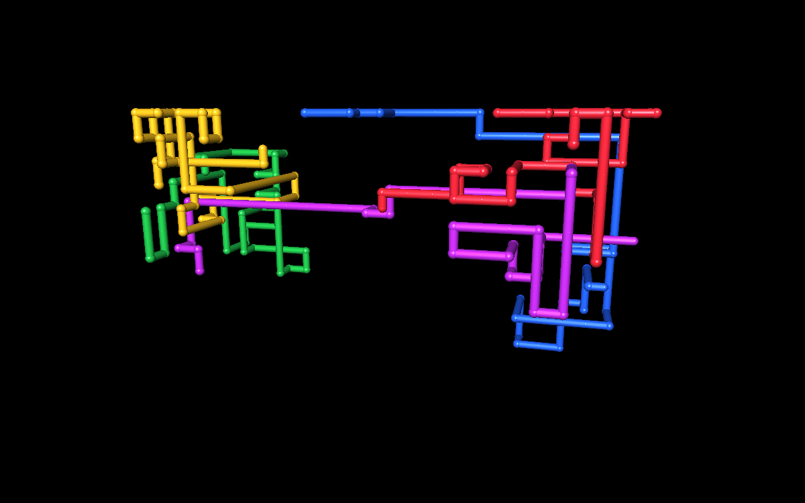
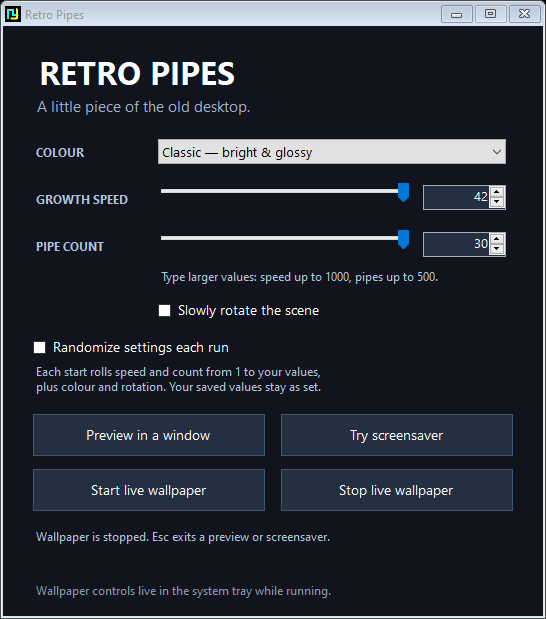

# Retro Pipes

Procedurally generated, glossy 3D pipes inspired by the classic Windows screensaver. Runs as a live desktop wallpaper, a Windows screensaver, or a windowed animation.



## Download and run

Download **Retro-Pipes-v1.1.1.zip** from the [latest release](https://github.com/S0MBRX/retro-pipes/releases/latest), extract it, and open **RetroPipes.exe**.

- **Start live wallpaper** animates behind desktop icons. Use its system-tray icon to open controls or stop it.
- **Try screensaver** fills your displays. Move the mouse or press any key to exit.
- **Preview in a window** supports Space to pause, R for a fresh layout, and Esc to close.
- To use it when Windows is idle, right-click **RetroPipes.scr**, choose **Install**, and configure the wait time in Windows Screen Saver Settings. Keep the files in a permanent folder.

## Settings



Choose Classic, Electric or Chrome colours, growth speed, pipe count and optional slow rotation.

Every layout picks a random starting colour from the selected theme. A single pipe can use any of the theme's colours, including when randomized settings are turned off.

The number boxes accept **speed 1–1000** and **pipe count 1–500**, beyond the sliders' convenient ranges of 1–10 and 1–9. Larger typed values remain active even though the slider stays at its end. Moving a slider selects a value within its regular range.

**Randomize settings each run** chooses speed and pipe count between 1 and the respective entered values, plus a random colour theme and rotation setting. Starting a preview, wallpaper, or screensaver makes a new roll. All monitors use that roll with independent layouts. Automatic layout resets and the R shortcut preserve the current run's settings. Manual values stay saved.

Settings save when starting a mode or closing the controls. They are stored in `%LOCALAPPDATA%\RetroPipes\settings.xml`.

## Requirements

- 64-bit Windows 10 or 11 with .NET Framework 4.x and OpenGL support.
- No installer, administrator access, network connection, or extra packages are required to run the app.
- Tested on Windows 10. Live wallpaper uses Explorer's WorkerW surface; compatibility may vary with shell changes or other wallpaper apps. Restart wallpaper after Explorer, display layout, or scaling changes.
- Wallpaper does not register itself to start with Windows. The app is unsigned.
- This is an original recreation, not Microsoft's original screensaver binary.

## Build

From the repository folder, run this in PowerShell:

```powershell
.\source\Build.ps1
```

The script uses the C# compiler bundled with 64-bit .NET Framework and produces `RetroPipes.exe` and `RetroPipes.scr` in the repository root. No NuGet dependencies are needed.

## Test

On a Windows desktop, run:

```powershell
New-Item -ItemType Directory -Force work | Out-Null
$process = Start-Process .\RetroPipes.exe -ArgumentList '--self-test work' -Wait -PassThru
if ($process.ExitCode -ne 0) { throw 'Self-test failed. See work/test-error.txt.' }
Get-Content .\work\test-results.txt
```

The tests exercise randomized settings, extended values, serialization, high-speed growth, dense scenes, collision avoidance, scene cycling, OpenGL rendering, preview embedding, launcher controls and wallpaper attachment when a desktop surface is available. Test windows are placed offscreen. Tests leave saved user settings unchanged.

See [README.txt](README.txt) for command-line modes and uninstall instructions.
